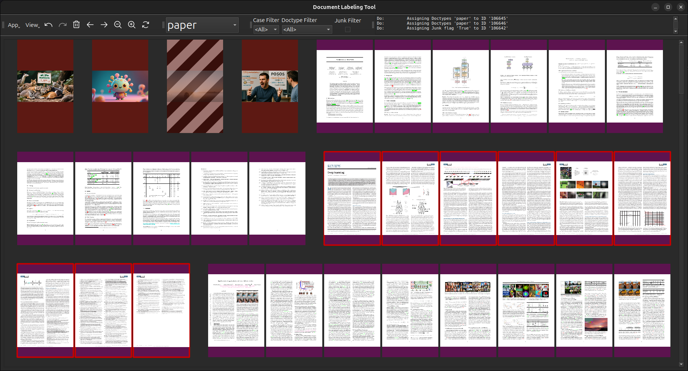
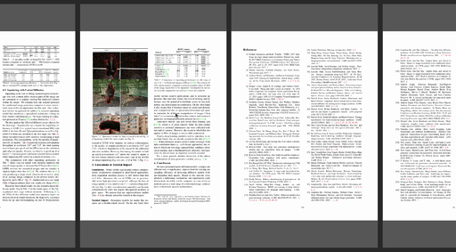
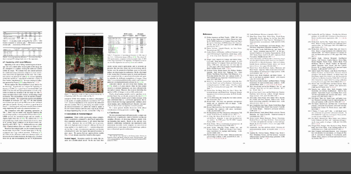
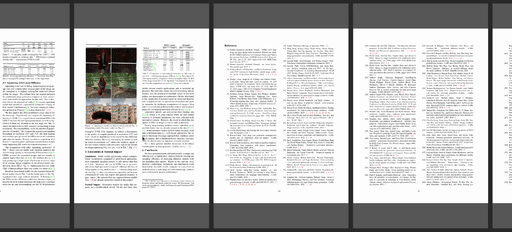

# Sinabis LabelKit

[](https://www.python.org/)
[]()

> **An intuitive, flexible, and scalable tool for high-efficiency labeling of document datasets**

<p align="center">
  
</p>


## ✨ Features

- **Multi-user friendly**
    Support for concurrent labeling of the same dataset using multiple clients.

- **Dual Backend Support**
    Supports **MongoDB** or **PostgreSQL** backends for the document store.

- **Modern UI**
    Built with **PyQt6**, featuring a responsive interface, keyboard shortcuts, and drag-and-drop mouse gestures. Optimized for high efficiency labeling.

- **Import and Export Flexibility**
    Import and Export datasets as JSON, either for transfer between document stores, or for subsequent learning tasks.


## 🚀 Quick Start

### Prerequisites
- Python ≥ 10
- [MongoDB](https://www.mongodb.com/try/download/community) >= 5.0 **or** [PostgreSQL](https://www.postgresql.org/download/) >= 10.0
- [uv](https://docs.astral.sh/uv/getting-started/installation/) (package manager)


### Installation

```bash
# Clone the repo
git clone git@github.com:sinabis/sinabis_labelkit.git
cd sinabis_labelkit

# Create virtual environment und install dependencies
uv sync
```

Create a copy  of `.env.example` and store it as `.env` . Choose either **postgres** or **mongodb** as backend, and modify database properties if necessary.
```env
# === Global Backend Selector ===
DB_BACKEND          = postgres

# === Backend: Postgres ===
DB_PSQL_HOST        = localhost
DB_PSQL_PORT        = 5432
DB_PSQL_NAME        = docdata
DB_PSQL_USER        = postgres
DB_PSQL_PASSWORD    = password

# === Backend: Mongo ===
DB_MDB_HOST         = mongodb://127.0.0.1
DB_MDB_PORT         = 27017
DB_MDB_NAME         = docdata
DB_MDB_USER         =
DB_MDB_PASSWORD     =
```

Now the app is ready to run
```bash
uv run app.py
```

## 🎯 Example Workflow

1. **Create a new case** (Provide a root directory containing files such as PDF's or images)
2. **Manually split PDF files into documents** (Logical clustering of related pages within large PDF files using mouse gestures)
3. **Manually assign document types**
4. **Mark irrelevant pages as junk**
5. **Double-Check manual changes** (Within a side-by-side view using document type filters)
6. **Export for further processing** (Creates a JSON file)


## 🖱️ Mouse Gestures

Easily decompose large PDFs into documents with correlated pages by drawing quick gestures on the canvas — no manual page selection required. Right-click to initiate drawing, and colored dots will indicate available actions in real time.

### 🔴 Split
Draw a vertical line between two pages of a document to split the document at that point.



### 🟢 Merge
Draw a horizontal line between two documents to combine them.

Requirements:
- Both documents must be of the same document type
- Part of the same original file
- Share the same junk status (clean or flagged)



### 🔵 Cluster
Draw a horizontal line across one page — or between two pages — to assign that range to a new document.

The action preserves context:
- If pages exist before the selection → new document for the prefix
- If pages exist after the selection → new document for the suffix
- Result: 1–3 new documents, depending on selection scope




## 🧪 Tests

To ensure a correct document store functionality, execute the provided test scripts using **pytest**.
```bash
pytest tests/
```

By default, tests are executed for both backends.
However, tests can be restricted to a single backend by modifying the `.env` file.
```env
# === Test Settings ===
TEST_POSTGRES       = 1
TEST_MONGODB        = 1
```


## #️⃣ UI Interaction

### Mouse Actions
|Key        | w.o.                          |Shift                  |Ctrl       |Alt            |
|---        |---                            |---                    |---        |---            |
|Left       |Select Page / Abort Drawing    |                       |Open File  |               |
|Right      |Draw Line                      |                       |Focus Page |               |
|Middle     |Translation                    |                       |           |               |
|Wheel Roll |V/H Scrolling                  |Pagewise V/H Scrolling |Zooming    |               |


### Keyboard Actions
|Key                |No Modifiers           |Ctrl                   |Ctrl + Shift   |
|---                |---                    |---                    |---            |
|Esc                |Close App              |                       |               |
|F5                 |Update Documents       |                       |               |
|F11                |Fullscreen / Window    |Minimize               |               |
|1                  |Page View              |                       |               |
|2                  |Document View          |                       |               |
|3                  |Labeling View          |                       |               |
|Up / Down Arrows   |Vert. Scroll           |                       |               |
|Left / Right Arrows|Hor. Scroll            |Select prev / next Doc |               |
|Page Up / Page Down|Pagewise Vert. Scroll  |                       |               |
|Plus               |                       |Zoom In                |               |
|Minus              |                       |Zoom out               |               |
|Delete             |Mark Junk / not Junk   |                       |               |
|Spacebar           |Select next Doc        |                       |               |
|Alt                |Open Labeling Box      |                       |               |
|Z                  |                       |Undo                   |Redo           |
|I                  |                       |Import                 |               |
|E                  |                       |Export                 |               |
|N                  |                       |New Case               |               |
|J                  |                       |Toggle Junk Filter     |               |
|D                  |                       |Toggle Information Panel|              |
|[A-Z]              |Doctype Labeling       |                       |               |


*Made with Python, PyQt6, and a lot of coffee ☕*
